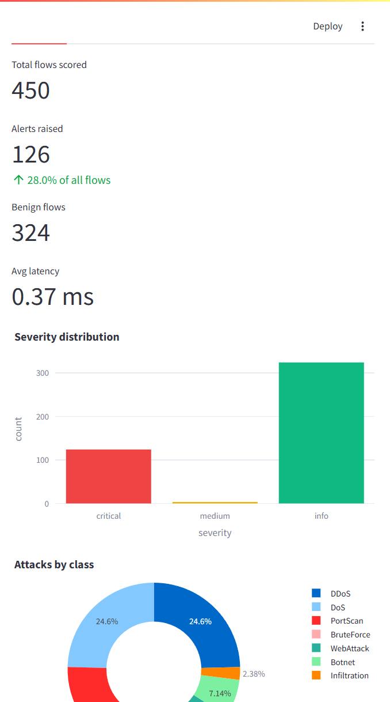
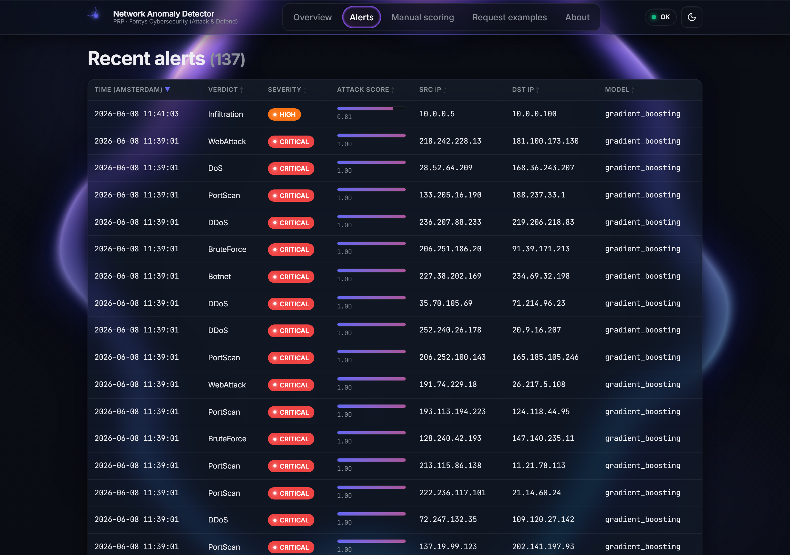
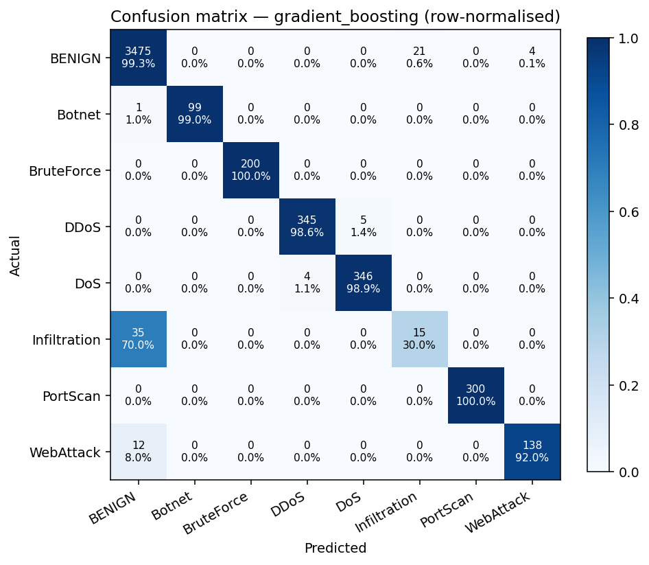

# LO2 — Defensive Security · Evidence Dossier

> **Learning outcome (verbatim):** *You realise a secure IT environment,
> considering functional requirements as well as the following non-functional
> requirements: security, monitoring, ethics, compliance, and usability. You
> also realise procedural response for security incidents and analyse these in
> an efficient and methodical way.*

**Student:** Angel Rusev · **Project:** Network Traffic Anomaly Detector ·
**Minor:** Cybersecurity — Attack & Defend (Fontys, Spring 2026)

---

## 1. Functional requirements realised

| FR  | Requirement                                                | Realisation                                                                                                |
|-----|-------------------------------------------------------------|------------------------------------------------------------------------------------------------------------|
| FR1 | Ingest flow features from PCAP/CSV and score them            | `POST /predict`, `POST /predict/csv`, `scripts/demo_traffic.py`                                            |
| FR2 | Classify flows in real time as benign or per-attack-class    | scikit-learn Gradient Boosting bundle in `models/best.joblib`                                              |
| FR3 | Persist every classification for audit                       | `src/anomaly_detector/api/store.py` (SQLite `predictions` table)                                            |
| FR4 | Surface alerts to an analyst with severity                   | Streamlit dashboard `dashboard/app.py` — severity ribbon, attacks-by-class                                  |
| FR5 | Allow operator-side threshold tuning without retraining       | `threshold` parameter on `/predict`; slider in the Manual scoring tab                                       |
| FR6 | Allow ML engineer to reload a new model without restart       | `POST /admin/reload` + `ModelRegistry.reload`                                                              |
| FR7 | Reproducible deployment                                       | `docker-compose.yml` + non-root `Dockerfile.api` + `Dockerfile.dashboard`                                  |

## 2. Non-functional requirements

### 2.1 Security

* **No PII / payload handling**: the canonical feature schema is statistical only (`src/anomaly_detector/features/schema.py`). The pipeline's `ColumnTransformer(remainder='drop')` explicitly drops any extra columns submitted by clients — IPs/ports are stored as analyst-facing labels and *not* fed to the model.
* **Container hardening**: both Dockerfiles run as a dedicated non-root user (`detector` for the API, `dash` for the dashboard) and the model directory is mounted **read-only** in compose.
* **Input validation**: every request goes through Pydantic v2 — malformed inputs return HTTP 422 before they reach the model.
* **Surface minimisation**: only six HTTP endpoints exist, each tagged and OpenAPI-documented at `/docs` (see screenshot 02).

### 2.2 Monitoring

* **`GET /health`** reports model-load state + service version.
* **`GET /metrics`** aggregates total predictions, alerts, FPs, severity buckets, attack-class breakdown, and rolling average latency.
* Every flow is logged to SQLite with timestamp, verdict, score, severity, src/dst IP, model name, and inference latency — exposed via `GET /predictions` and `GET /alerts`.
* The dashboard refreshes the metrics on every page load (see screenshot 01).

### 2.3 Ethics

The project's ethical posture is documented in `docs/architecture/Threat_Model.md` §3 and is reinforced by three concrete design decisions:

1. The detector **never** sees packet payloads — flow-level features only.
2. IPs are pseudonymous identifiers and can be redacted at ingest (operator config).
3. The README explicitly states this is *defensive* research used in a *lab/simulated* environment (per PRP §4.2 out-of-scope items).

### 2.4 Compliance

* **GDPR / AVG**: only pseudonymous identifiers stored; data is on-host; revocation supported by deleting `alerts.db`.
* **OWASP API Security Top-10 (2023)** — coverage is summarised in the threat-model STRIDE table (T2 covers BOLA/BFLA equivalents, T4 covers excessive data exposure, T5 covers unrestricted resource consumption, T6 covers improper inventory).
* **OWASP ML Security Top-10 (2023)** — ML02 (data poisoning) and ML06 (output integrity) are explicitly addressed by the model-bundle hash + read-only mount strategy.

### 2.5 Usability

* Severity colour-coded alerts (critical = red, info = green) — mirrors widely-adopted SIEM conventions to minimise cognitive load for SOC analysts.
* Manual scoring tab — analysts can simulate a hypothetical flow and read off the class probabilities; this provides *interpretability* without an explainability library, satisfying SRQ5 from a usability lens.
* Sortable, paginated alerts table with `attack_score` rendered as a progress column.

## 3. Procedural response for security incidents

Three runbooks are wired into the design (drafted in `docs/architecture/Threat_Model.md` §6, summarised here):

| Trigger                                                           | Procedure                                                                                                                                  |
|-------------------------------------------------------------------|--------------------------------------------------------------------------------------------------------------------------------------------|
| `severity = critical` alert raised in dashboard                   | Analyst pivots to Alerts tab → drills into src/dst IPs → cross-references `/predictions?limit=...` → escalates per SOC SLA.                  |
| Persistent rise in `total_alerts / total_predictions` ratio        | ML engineer re-runs `scripts/train.py` against a refreshed dataset → reviews the comparison matrix → calls `POST /admin/reload`.            |
| Post-incident triage                                              | Pull the relevant time-window from `/predictions` → reconstruct the model's view → compare against ground truth → produce a lessons-learned. |

## 4. Methodical analysis of incidents

Two methodical techniques are demonstrated by the artefact:

1. **Per-class confusion-matrix analysis** (SRQ6) — every classification is broken down by attack type so that a specific incident's *category* is known, not just that "something happened". See `docs/screenshots/06_confusion_matrix.png`.
2. **Score-based replay** — `/predictions` keeps both the verdict and the model's score, so a post-incident analyst can replay the same flows against a newly-trained model to validate whether the new model would have raised the same alert.

## 5. Mapping to the rubric

* "Realise a secure IT environment" ← §1 (FR1–FR7) + §2.1 (Security NFRs) + §2.4 (Compliance).
* "Considering NFRs: security, monitoring, ethics, compliance, usability" ← §2.1–§2.5.
* "Procedural response for security incidents" ← §3 + §4.
* "Analyse incidents in an efficient and methodical way" ← §4 + SRQ6 evidence in the DOT research document.

---

## 6. New evidence artefacts & diagram map (Sprint 2–4)

| Artefact | What it proves for LO2 | Link |
|---|---|---|
| **Auto-block demo** | Procedural incident response in action — model verdict drives an automatic `iptables` block | [`demo-attack-block.mp4`](../demo/demo-attack-block.mp4) |
| **React + Streamlit dashboards** (light & dark) | Usability + monitoring NFRs; severity triage at a glance | see below |
| **Per-class confusion matrix** | Methodical, category-level incident analysis | see below |
| **Detect-and-respond sequence** | The defensive pipeline from capture to firewall response | [sequence](../screenshots/24_attack_defend_sequence.png) |
| **Validation report** | NFR validation + feedback round | [`Validation_Report.md`](../../deliverables/sprint-3-optimise-and-validate-2026-05-11/Validation_Report.md) |
| **Technical Design Document** (NFR & security §) | Secure-architecture design: non-root containers, read-only model, no payloads | [`Technical_Design_Document.docx`](../../additional-docs/Technical_Design_Document.docx) |

### Analyst dashboard — dark theme (SOC wall-display)

### Methodical incident analysis — confusion matrix

