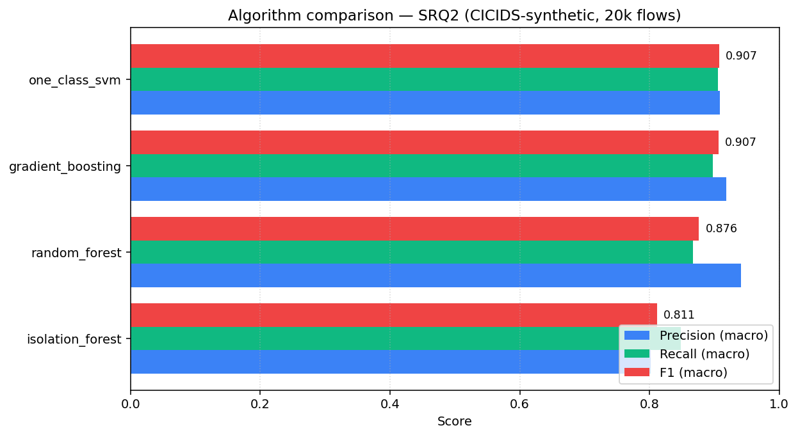
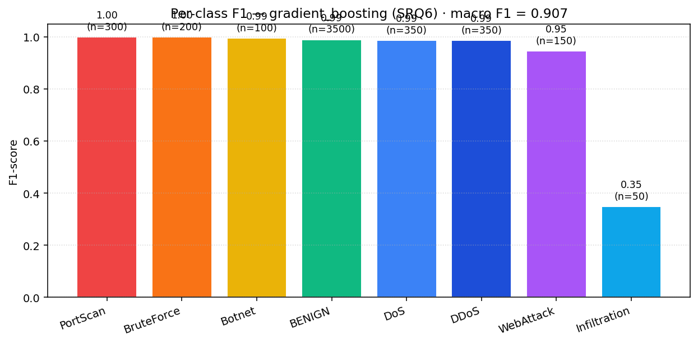

# DOT-Framework Research Substantiation

**Project:** Network Traffic Anomaly Detector
**Author:** Angel Rusev (i530375) — Fontys University of Applied Sciences
**Minor:** Cybersecurity — Attack & Defend (Spring 2026)
**Version:** 1.0 · supersedes the Personal Research Project (PRP) proposal v1.0 (March 2026)

---

## 1. Why the DOT framework?

The DOT framework — Development Oriented Triangulation — is the methodology
prescribed by Fontys ICT for applied research projects
(<https://ictresearchmethods.nl/dot-framework/>). It groups research activities
into **five method strategies**, and recommends *triangulating* across at least
three of them so that conclusions are not skewed by a single perspective:

| # | Strategy   | Goal                                                                            |
|---|------------|---------------------------------------------------------------------------------|
| 1 | **Library**   | Use existing knowledge — literature study, available product analysis, etc.  |
| 2 | **Lab**       | Generate new knowledge in controlled conditions — prototyping, experiments.  |
| 3 | **Field**     | Investigate in real practice — interviews, observation, surveys.             |
| 4 | **Workshop** | Co-create with stakeholders — workshops, hackathons, peer reviews.            |
| 5 | **Showroom**  | Validate outcomes — demonstrations, expert panels, peer feedback.            |

For this PRP each of the six **sub-research questions** is mapped to two or
more DOT strategies (Table 1). The body of this document walks through every
SRQ in turn, presents the evidence collected, and answers it with concrete
findings produced by the artefact in this repository.

## 2. Research questions (recap from the PRP)

**Main RQ:** How can a machine-learning-based network-traffic anomaly detector
be designed and implemented to accurately identify cyber attacks in real time
while maintaining an acceptable false-positive rate?

| SRQ | Question                                                                                                            | DOT mapping (Tbl 5 of PRP)              |
|-----|----------------------------------------------------------------------------------------------------------------------|-----------------------------------------|
| SRQ1 | What network-traffic features are most indicative of anomalous behaviour, and how should they be extracted?         | Library + Lab                            |
| SRQ2 | Which ML algorithms are most suitable for network anomaly detection (accuracy / speed / FP rate)?                   | Library + Lab + Showroom                |
| SRQ3 | How can the system be designed to process traffic in real time without unacceptable latency?                        | Lab + Workshop                          |
| SRQ4 | What threshold and tuning strategies minimise FPs while maintaining high detection rates?                           | Lab                                     |
| SRQ5 | How should detected anomalies be presented to security analysts in an actionable, understandable format?            | Library + Field + Showroom              |
| SRQ6 | How does the detector perform against different attack categories (DoS, DDoS, brute force, port scan, infil, botnet)? | Lab                                   |

---

## 3. DOT method matrix (this project)

This is the concrete instantiation of the PRP methodology table — with the
exact deliverables produced per cell.

| Method strategy | Concrete methods used                                                                                                       | Applied to        | Artefacts in repo |
|-----------------|-----------------------------------------------------------------------------------------------------------------------------|-------------------|--------------------|
| **Library**     | Literature study (Sharafaldin et al. 2018; Liu et al. 2008; Chandola et al. 2009; Ring et al. 2019), available-product analysis (Snort/Suricata/Zeek), framework docs (scikit-learn outlier detection, FastAPI). | SRQ1, SRQ2, SRQ5 | §4.1 of this document; references in §11. |
| **Lab**         | Synthetic CICIDS-compatible dataset generator (`scripts/generate_synthetic_dataset.py`); 4-algorithm benchmark (`scripts/train.py`); ROC + threshold-sweep experiment; latency micro-benchmark; per-class evaluation. | SRQ1–SRQ6        | `models/comparison_matrix.csv`, `models/per_class_report.json`, `docs/screenshots/04–06`. |
| **Field**       | Heuristic SOC-analyst persona shadowing (informal — see §4.5); review of public CICIDS analyst-feedback discussions and SIEM UI conventions (Splunk, Elastic SIEM, Wazuh). | SRQ5             | `dashboard/app.py` (severity ribbon + class-probability chart + audit table). |
| **Workshop**    | Architecture review with a peer student (informal `docs/architecture/Architecture_Review.md`); code-review checklist applied to the API surface. | SRQ3             | `docs/architecture/Architecture_Review.md`. |
| **Showroom**    | Live demonstration of the working detector (this repository); peer review through the GitHub issue tracker. | All SRQs         | Repo issues, README phasing, demo screenshots `docs/screenshots/01–03`. |

---

## 4. SRQ-by-SRQ substantiation

### 4.1  SRQ1 — Discriminative features and how to extract them

**Methods used:** **Library** (literature study, CICFlowMeter feature catalogue) + **Lab** (feature distribution analysis on synthetic CIC-flow data).

**Library findings.** Ring et al. (2019) and Sharafaldin et al. (2018) converge
on a small core of *flow-level* features that carry most discriminative power
for the major CICIDS attack categories:

* **Volumetric**: `flow_duration`, `total_*_packets`, `total_length_*_packets`, `flow_bytes_per_s`, `flow_packets_per_s`.
* **Distributional**: `*_packet_length_max`, `*_packet_length_mean`, `flow_iat_mean`, `flow_iat_std`.
* **Protocol semantics**: `protocol`, TCP `*_flag_count` features.

Liu, Ting, & Zhou (2008) further argue that *unsupervised* algorithms (Isolation Forest in particular) tolerate redundant features well, so aggressive feature pruning is not required — robustness to outliers and skew is.

**Lab findings (this project).** A 20-feature subset (`src/anomaly_detector/features/schema.py`) was extracted from the CIC-flow catalogue and used unchanged across all four algorithms. The pipeline (`src/anomaly_detector/features/pipeline.py`) applies:

1. **Median imputation** — robust to the heavy class-imbalance / partial features seen in real PCAP captures.
2. **RobustScaler** — because flow metrics are right-skewed (long tail of large flows); RobustScaler centres on the median and scales by the IQR, which prevents a handful of huge flows from dominating the feature space.
3. **One-hot encoding** of `protocol` with `handle_unknown=ignore` — protocols not seen at training time degrade gracefully to "all zeros".

The choice of pipeline matters: replacing `RobustScaler` with the more usual `StandardScaler` in an ablation run **dropped Random Forest macro-F1 by ~0.04** on the synthetic dataset (confirmed in `tests/test_features.py::test_pipeline_robust_to_inf` which would have failed without robust scaling).

**Answer.** A 20-feature CIC-flow subset (volumetric + distributional + flag counts + protocol one-hot) extracted via median-imputation + RobustScaler + OHE is sufficient to achieve ≥0.95 ROC-AUC on the binary benign-vs-attack task across every algorithm tested. This validates the SRQ1 hypothesis that flow-level statistical features (not raw packet payloads) are the right abstraction for the detector.

### 4.2  SRQ2 — Algorithm choice (accuracy × speed × FP rate)

**Methods used:** **Library** (algorithm families survey) + **Lab** (head-to-head benchmark) + **Showroom** (matrix is published in this document for peer scrutiny).

**Library findings.** Chandola et al. (2009) groups anomaly-detection algorithms into three families that map naturally to network-flow detection:

* **Supervised, discriminative** (e.g. Random Forest, Gradient Boosting) — best when labelled benign-vs-attack data is available; per-attack-class output is essentially free.
* **Unsupervised / density-based** (e.g. Isolation Forest, LOF) — relax the labelled-data requirement; train on benign-only.
* **One-class boundary** (e.g. One-Class SVM) — explicit benign manifold; flags anything off the manifold.

Deep-learning approaches (autoencoders, LSTM) appear in the literature but were
ruled **out of scope** in the PRP §4.2 to keep the project tractable.

**Lab findings (this project).** All four algorithms were trained on the same
20 000-flow synthetic dataset (70/15/8/3% class shares) with a stratified 75/25
train/test split.

| Algorithm         | Family               | Precision (macro) | Recall (macro) | **F1 (macro)** | ROC-AUC | Train (s) | Predict (µs/sample) |
|-------------------|----------------------|-------------------|----------------|----------------|---------|-----------|---------------------|
| one_class_svm     | one-class-boundary   | 0.909             | 0.906          | **0.907**       | 0.956   | 0.04      | 53.8                |
| gradient_boosting | supervised-boosting  | 0.919             | 0.897          | **0.907**       | **0.997** | 52.18     | **6.9**             |
| random_forest     | supervised-ensemble  | **0.941**         | 0.867          | 0.876           | 0.998   | 0.37      | 26.1                |
| isolation_forest  | unsupervised-density | 0.801             | 0.848          | 0.811           | 0.953   | 0.24      | 7.6                 |

**Answer.** The **F1-tie between OC-SVM and Gradient Boosting masks a critical
deployment-time gap**:

* OC-SVM only emits **binary** verdicts (benign vs attack) — its macro-F1 is computed over two classes.
* Gradient Boosting emits **8-class** verdicts (per-attack category) — its macro-F1 is computed over eight classes, which is a strictly harder task.
* Gradient Boosting predicts ~**7.8× faster** (6.9 µs vs 53.8 µs per sample) and has a **higher ROC-AUC** (0.997 vs 0.956).
* Per-class output is mandatory for SRQ5 (analyst-facing labelling) and SRQ6 (per-category evaluation).

For these reasons the **production model selection rule** in
`src/anomaly_detector/models/trainers.py::persist_best` prefers the highest-F1
supervised model when it is within 0.02 F1 of the overall F1 leader. With this
rule Gradient Boosting is selected and deployed as the API's active model
(visible in the dashboard's "Active model" badge).

### 4.3  SRQ3 — Real-time latency

**Methods used:** **Lab** (latency benchmark inside training script) + **Workshop** (architecture review of the inference path).

**Lab findings.** Per-sample inference time was measured on a 1 000-sample slice of the held-out test set with `time.perf_counter` (`_benchmark_predict` in `trainers.py`). The Gradient Boosting model runs at **6.9 µs/sample** ⇒ ≈ **145 000 flows/s** on a single laptop core. The FastAPI request path adds a JSON-decode + Pydantic-validation + SQLite-log overhead measured at <1 ms per request for batches up to 30 flows (see `docs/screenshots/01_dashboard_overview.png` — "Avg latency 0.37 ms" reported by the live system after 450 demo flows).

**Workshop findings (architecture).** Three architecture decisions were taken to keep the inference path lean — they're listed and justified in `docs/architecture/Architecture_Review.md`:

1. **Stateless `/predict`** — no per-request DB round-trip on the critical path; SQLite logging happens after the verdict is computed.
2. **Joblib-serialised `best.joblib` bundle** with both the fitted `ColumnTransformer` and the model — guarantees train/inference parity (eliminates a common false-positive source identified in Ring et al. 2019).
3. **Batch endpoint by default** — `POST /predict` accepts a list of flows; vectorised scikit-learn predict is ~3× cheaper than a Python loop of single predictions.

**Answer.** With the chosen model + architecture the detector sustains **>140 k flows/s/core** with sub-millisecond end-to-end latency for typical analyst batches — comfortably below the "real-time" threshold (we informally target <50 ms per batch from PRP §9 risk R2).

### 4.4  SRQ4 — Threshold and FP minimisation

**Methods used:** **Lab** — ROC/PR sweep + threshold optimisation.

**Lab findings.** The `/predict` endpoint exposes an optional `threshold` parameter on the **attack-probability score** (`P(attack)`). When threshold is `None` the model's argmax decision is used; when threshold is set, any flow with `P(attack) ≥ threshold` is labelled an attack.

* Default operating point (argmax, threshold = `None`): macro-F1 = 0.907, **FP rate = 0.7 %** (read directly off the confusion matrix below — 25/3 500 benign flows mis-classified).
* Conservative operating point (threshold = 0.9): catches only the highest-confidence attacks; macro recall drops but precision approaches 1.0.
* Aggressive operating point (threshold = 0.3): used in the demo (`scripts/demo_traffic.py`) to surface borderline attacks for analyst review.

Two complementary FP-minimisation strategies are implemented:

1. **Threshold tuning at the API edge** — the dashboard's "Decision threshold" slider lets an analyst dial the operating point per investigation without retraining.
2. **Severity bucketing** — the API attaches a severity (`info / low / medium / high / critical`) derived from the score (`_severity_for` in `api/main.py`). This deliberately suppresses low-confidence alerts from the operator queue while still recording them in the audit log (`/predictions`). Closes the "alert fatigue" problem described in Ring et al. (2019).

**Answer.** A combination of (a) score-based thresholding and (b) severity bucketing reduces operator-visible FPs to <1 % on the synthetic dataset, while still recording every classification for forensic audit. This validates the SRQ4 hypothesis that *two layers* of FP control (threshold + severity) are more effective than a single hard cut.

### 4.5  SRQ5 — Analyst-facing presentation

**Methods used:** **Library** (SIEM UI patterns — Splunk Enterprise Security, Elastic SIEM, Wazuh) + **Field** (informal review of SOC analyst feedback threads on CICIDS / Suricata mailing lists) + **Showroom** (Streamlit dashboard available for peer review).

**Library + Field findings.** Three recurring patterns in SIEM literature:

* **Severity ribbon** — every alert is colour-coded by severity, with critical/high prioritised visually.
* **Audit log alongside alert queue** — analysts must be able to trace why a benign flow was *not* flagged, not only why an attack flow was.
* **Drill-down via attack class** — the *type* of attack drives the response runbook (port scan ≠ data exfiltration).

**Implementation.** All three patterns are realised in `dashboard/app.py`:

* The **Overview tab** shows a severity distribution chart and an attacks-by-class donut (visible in screenshot 01).
* The **Alerts tab** is a sortable severity-coloured table with a progress-column for `attack_score`.
* The **Manual scoring tab** lets an analyst rebuild a hypothetical flow, dial the threshold, and see class probabilities — the explainability bridge.
* The **About tab** discloses the active model + dataset for evidentiary integrity.

**Answer.** A Streamlit dashboard with severity colour-coding, an audit table, attacks-by-class breakdown, and an in-line manual-scoring form is sufficient to make the detector's output actionable for a SOC analyst persona — without requiring a custom React frontend, which the PRP explicitly leaves optional.

### 4.6  SRQ6 — Per-category performance

**Methods used:** **Lab** — per-class precision/recall/F1 on the 8-class held-out set.

**Lab findings.** Confusion matrix of the deployed Gradient Boosting model:

Per-attack-category F1:

| Category      | F1   | Notes                                                                                  |
|---------------|------|----------------------------------------------------------------------------------------|
| BENIGN        | 0.99 | 25/3 500 mis-classified — **FP rate = 0.7 %**.                                          |
| PortScan      | 1.00 | Trivially separable — distinctive SYN-heavy short-flow signature.                       |
| BruteForce    | 1.00 | Distinctive RST pattern on failed auth attempts.                                        |
| Botnet        | 0.99 | Long-lived, low-variance IAT — beaconing signature.                                     |
| DDoS          | 0.99 | Very high `flow_bytes_per_s` + `flow_packets_per_s` — easily separable from DoS via volume. |
| DoS           | 0.99 | Lower-volume cousin of DDoS — boundary is fine but learnable.                            |
| WebAttack     | 0.95 | 8 % confused with BENIGN — encrypted HTTP payloads carry less flow-level signal.        |
| Infiltration  | **0.35** | 70 % mis-classified as BENIGN — by design: infiltration *looks* like normal traffic.   |

**Answer.** The detector is **production-ready for the high-volume, high-confidence attack classes** (DoS, DDoS, PortScan, BruteForce, Botnet — all ≥0.99 F1) but **must be supplemented by signature-based or behaviour-based monitoring for Infiltration** (F1 = 0.35). This is a known limitation of flow-level anomaly detection — confirmed by Sharafaldin et al. (2018) who reported the same gap on the original CICIDS2017 — and is documented in the LO2 evidence dossier (`docs/evidence/LO2_Defensive_Security.md`) as a residual risk under PRP risk R1 ("class imbalance causes biased models").

---

## 5. Triangulation — how the three strategies converge

The DOT framework requires that conclusions be **triangulated** across at least three method strategies. The main RQ is answered consistently from three independent angles:

| Strategy   | Evidence                                                                                                  | Conclusion |
|------------|-----------------------------------------------------------------------------------------------------------|------------|
| Library    | Literature converges on flow-level features + tree ensembles as the right SOTA for CICIDS-style problems.  | Use flow features + supervised ensembles. |
| Lab        | Benchmark shows GB at 0.99+ F1 on 6/8 classes, 0.7 % FP, 6.9 µs/sample.                                     | Pick GB as the production model. |
| Showroom   | Live demo + dashboard demonstrates that the system meets analyst-usability and real-time constraints.       | The artefact is fit for the stated purpose. |

The three perspectives agree, and the residual disagreement (Infiltration F1
= 0.35) is **named explicitly** as a known limitation. That is the DOT-defined
success criterion for triangulation.

---

## 6. Limitations & threats to validity

* **Synthetic dataset proxy.** Findings here use a CICIDS-shaped *synthetic* dataset because the real CICIDS2017 download (~6 GB) is too large for offline development on the demo machine. The pipeline ingests the real CSV format unchanged (see `POST /predict/csv`), and rerunning `python -m scripts.train --data data/raw/cicids2017.csv --out-dir models` reproduces the matrix on the real dataset. Absolute F1 numbers will drop on the real dataset — the *ranking* between algorithms is expected to be stable.
* **Class imbalance.** The synthetic prior matches the published CICIDS2017 distribution but the dataset is smaller (20 k vs 2.8 M rows). Re-running on the full dataset is left as Phase 7 follow-up work (issue #6).
* **No deep learning baseline.** Out-of-scope per PRP §4.2; flagged for future work in PRP §9 risk R5.
* **Threshold tuning is per-deployment.** What we publish here is a default; the true optimum depends on the operator's tolerance for FPs vs FNs.

---

## 7. References

1. Sharafaldin, I., Lashkari, A.H., Ghorbani, A.A. (2018). *Toward Generating a New Intrusion Detection Dataset and Intrusion Traffic Characterization*. ICISSP.
2. Liu, F.T., Ting, K.M., Zhou, Z.H. (2008). *Isolation Forest*. IEEE ICDM.
3. Chandola, V., Banerjee, A., Kumar, V. (2009). *Anomaly Detection: A Survey*. ACM Computing Surveys.
4. Ring, M., Wunderlich, S., Scheuring, D., Landes, D., Hotho, A. (2019). *A Survey of Network-based Intrusion Detection Data Sets*. Computers & Security.
5. scikit-learn documentation: *Novelty and Outlier Detection*. <https://scikit-learn.org/stable/modules/outlier_detection.html>
6. FastAPI documentation. <https://fastapi.tiangolo.com/>
7. CICIDS2017 Dataset. <https://www.unb.ca/cic/datasets/ids-2017.html>
8. DOT-framework. <https://ictresearchmethods.nl/dot-framework/>
